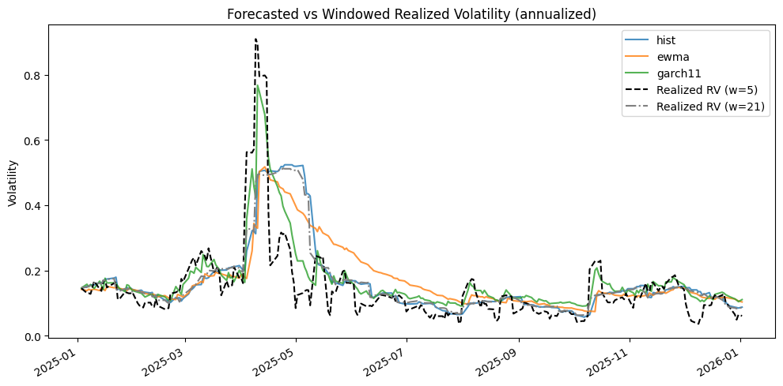
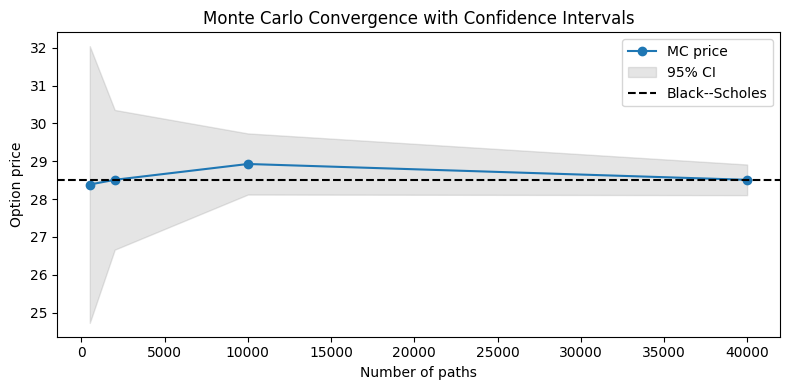

# Volatility Modeling & Option Pricing

Quant finance toolkit implementing classical volatility models and option pricing routines. The project downloads equity data (SPY by default), computes returns, forecasts volatility using historical rolling windows, EWMA, and GARCH(1,1), and prices European options via Black–Scholes and Monte Carlo under GBM. Out-of-sample evaluation uses chronological splits to avoid leakage.

## Features
- Data download via `yfinance` with reproducible preprocessing to adjusted close and log returns.
- Volatility estimation: rolling historical, EWMA variance, GARCH(1,1) (via `arch`).
- Option pricing: Black–Scholes closed form for calls/puts; Monte Carlo under GBM with convergence demo.
- Evaluation: rolling/expanding forecasts, metrics on variance (MSE), volatility (MAE), and QLIKE loss.
- Report and figures placeholders, plus notebooks for end-to-end exploration.

## Quickstart
```bash
# create environment and install deps
python -m venv .venv
source .venv/bin/activate
pip install -r requirements.txt

# run sample script (example usage)
python -m src.data_loader --ticker SPY --start 2015-01-01 --end 2024-01-01
```

## Methodology
1. **Data & returns**: Download daily adjusted closes; compute log returns `r_t = ln(P_t/P_{t-1})`; annualize volatility with `sqrt(252)`.
2. **Volatility models**:
   - Historical: rolling standard deviation over window `w`.
   - EWMA: recursive variance `sigma_t^2 = lambda*sigma_{t-1}^2 + (1-lambda)*r_{t-1}^2`.
   - GARCH(1,1): `sigma_t^2 = omega + alpha*r_{t-1}^2 + beta*sigma_{t-1}^2`, fitted via maximum likelihood.
3. **Evaluation**: Rolling/expanding window forecasts for an out-of-sample period; metrics are MSE on variance, MAE on volatility, and QLIKE.
4. **Option pricing**: Use forecasted annualized vol as input to Black–Scholes or Monte Carlo GBM simulation; MC convergence plotted vs paths.
5. **Transaction costs**: Sensitivity analysis parameters for bid-ask/fees to adjust option payoffs or spreads in notebooks/report.

## Running notebooks
Use the notebooks in `notebooks/` for the typical workflow: cleaning data, fitting volatility models, evaluating forecasts, and pricing options. Update the ticker and date ranges as needed. Save figures to `reports/figures/` and summarize findings in `reports/summary.md`.

## Tests
```bash
pytest -q
```

## Results placeholders
- Key figures: `reports/figures/`
- Summary: `reports/summary.md`

### Forecasted vs realized volatility (5D/21D realized volatility)


### Monte Carlo option pricing with 95% CI (convergence to Black–Scholes)
